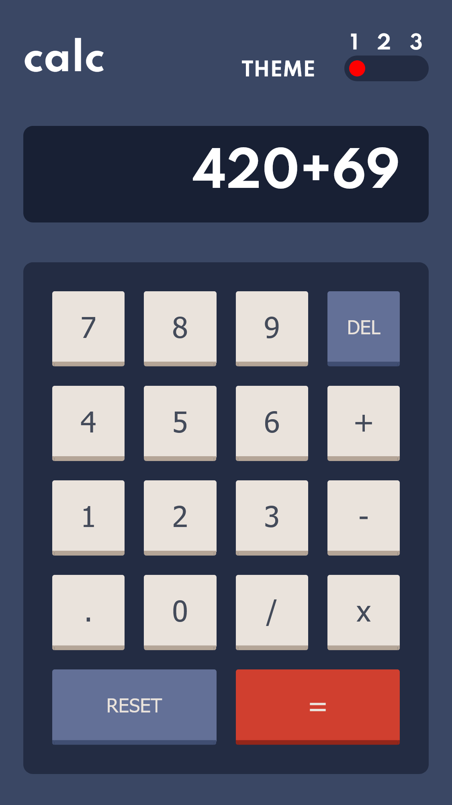
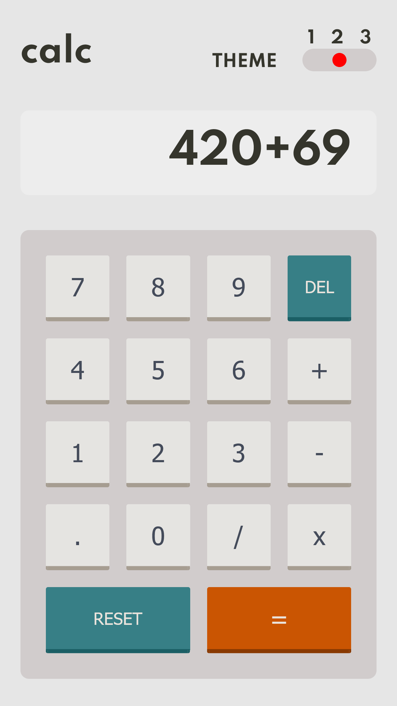
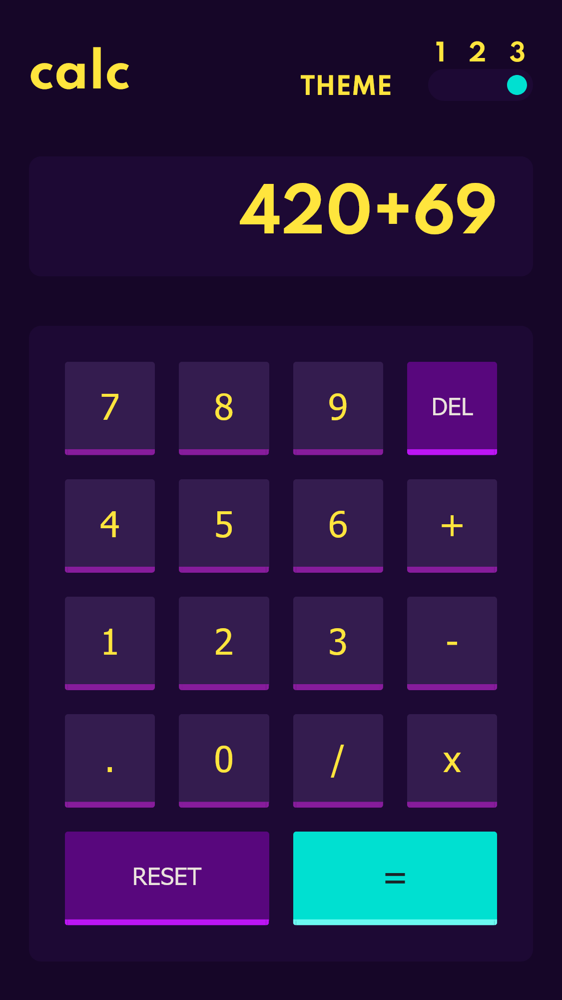
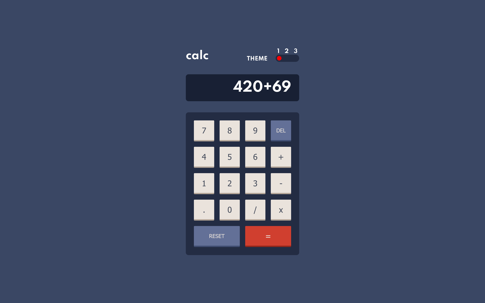
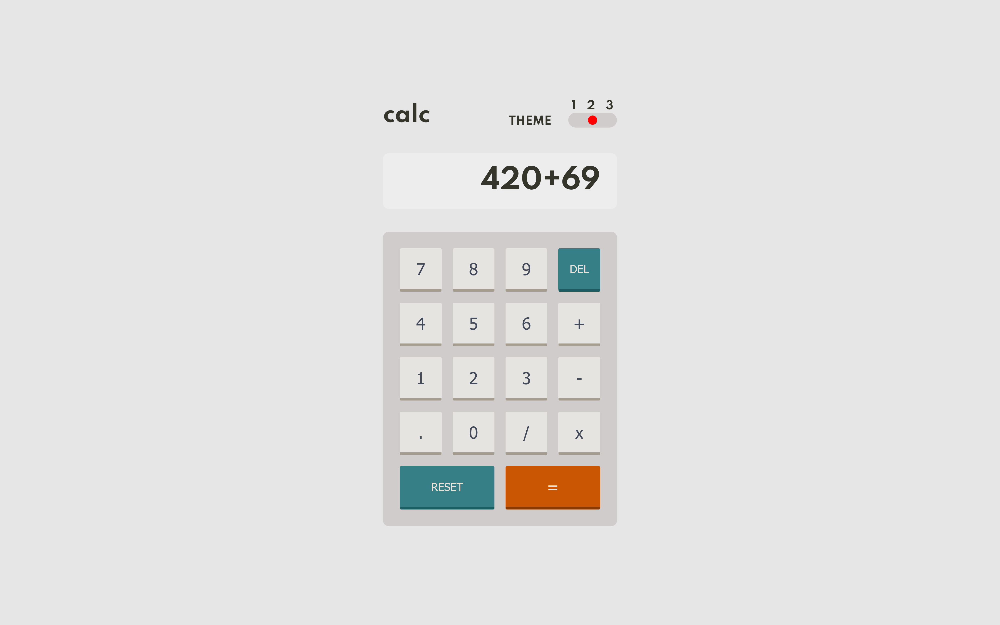
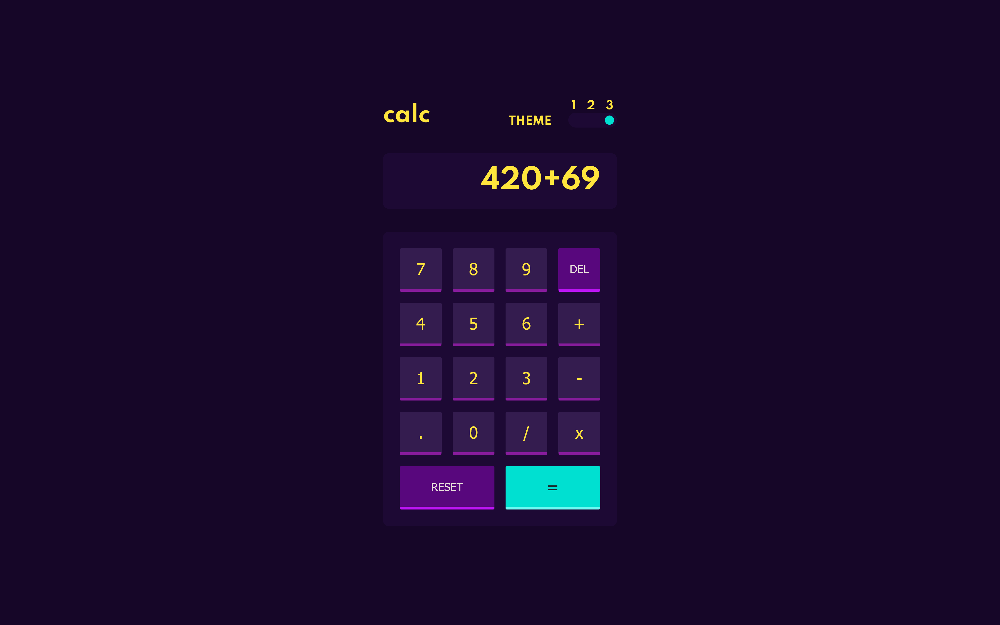

# Live Site

- Live Site URL: [Add live site URL here](https://your-live-site-url.com)

# Calculator app solution

This is a solution to the [Calculator app challenge on Frontend Mentor](https://www.frontendmentor.io/challenges/calculator-app-9lteq5N29). Frontend Mentor challenges help you improve your coding skills by building realistic projects.

## Table of contents

- [Overview](#overview)
  - [The challenge](#the-challenge)
  - [Screenshot](#screenshot)
- [My process](#my-process)
  - [Built with](#built-with)
  - [Useful resources](#useful-resources)
- [Author](#author)

## Overview

### The challenge

Users should be able to:

- See the size of the elements adjust based on their device's screen size
- Perform mathmatical operations like addition, subtraction, multiplication, and division
- Adjust the color theme based on their preference
- **Bonus**: Have their initial theme preference checked using `prefers-color-scheme` and have any additional changes saved in the browser

### Screenshot

## My process

### Built with

- Semantic HTML5 markup
- CSS custom properties
- Flexbox
- CSS Grid
- Mobile-first workflow
- JavaScript
- Sass

### Useful resources

- [Stackoverflow](https://stackoverflow.com/)
- [MDN](https://developer.mozilla.org/en-US/)

## Author

- GitHub - [Sunil Sharma](https://github.com/sunil-sharma-999/)
- Frontend Mentor - [@sunil-sharma-999](https://www.frontendmentor.io/profile/sunil-sharma-999)
- Twitter - [@yourusername](https://www.twitter.com/sharmasunil999)
